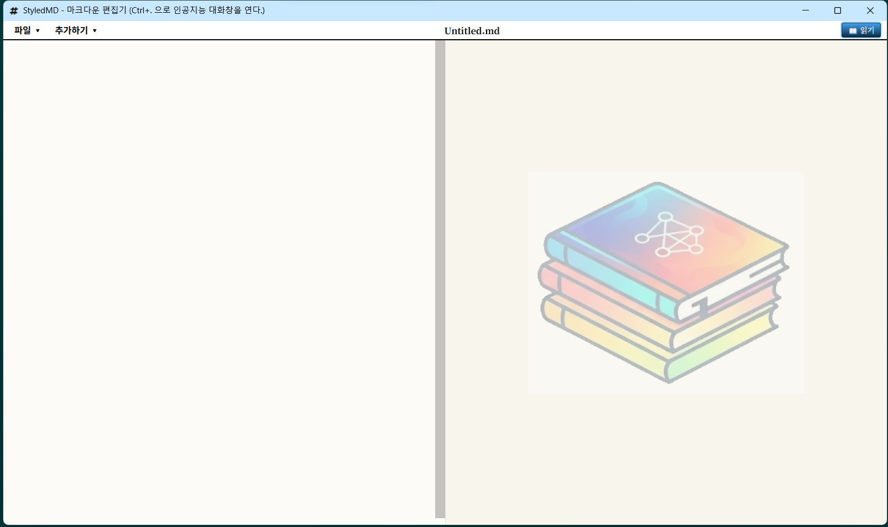

# StyledMD v2

Windows 전용 마크다운 에디터. 단일 실행 파일(`StyledMD.exe.zip`)으로 배포된다. 에디터(Monaco)와 렌더러(marked.js)를 내장하며, 다수의 AI 공급자와의 스트리밍 대화 기능을 갖춘다.



## 주요 기능

| 기능 | 설명 |
|---|---|
| **단일 실행 파일** | 복잡한 설치 없이 `StyledMD.exe` 하나로 모든 기능(프론트/백엔드)이 동작한다. |
| **Monaco 에디터** | VS Code의 에디터 컴포넌트를 기반으로 강력한 마크다운 입력 환경을 제공한다. |
| **실시간 렌더링** | `marked.js`를 통해 편집과 동시에 렌더링 결과를 즉각적으로 확인한다. |
| **AI 대화 패널** | `Ctrl+.` 단축키로 AI 채팅창을 열고 문서 내용이나 선택한 텍스트를 기준으로 질의한다. |
| **다중 AI 지원** | Google Gemini, Groq, Ollama, Upstage 등 다양한 AI 공급자와 SSE 스트리밍 통신을 지원한다. |
| **강력한 보안** | API 키는 AES-256-GCM 알고리즘과 Windows DPAPI를 활용한 이중 암호화로 로컬에 안전하게 저장된다. |
| **UI 모드 전환** | 읽기 모드(우측 고정 폭)와 편집 모드(전체 화면 확장) 간 유연한 전환이 가능하다. |

## 기술 스택 및 아키텍처

애플리케이션은 시작 시 사용 가능한 포트를 OS로부터 자동 할당받아 로컬 HTTP 서버를 구동하고, WebView2 창을 띄운다. 외부 네트워크 노출 없이 완전히 로컬 환경에서 폐쇄적으로 동작한다.

- **Backend**: Go (HTTP 서버, 파일 I/O, 암호화, API 라우팅)
- **Frontend**: HTML/CSS/JS, WebView2 (Chromium 기반)
- **UI/UX**: Monaco Editor, marked.js
- **빌드 도구**: `go-winres` (Windows 리소스 컴파일)

## 디렉토리 구조

- `pkg/`: 백엔드 Go 패키지 (핸들러, AI 연동, 파일 I/O, 암호화 로직 포함)
- `frontend/`: 프론트엔드 정적 파일 (HTML, CSS, JS, SVG 아이콘 등)
- `winres/`: Windows 리소스 구성 파일 (`winres.json`, 아이콘 이미지 등)
- `main.go`: 애플리케이션 진입점 및 WebView2 윈도우 초기화
- `build.ps1`: 윈도우 리소스 생성 및 실행 파일 빌드 자동화 스크립트

## 빌드 방법

Windows 환경에서 소스 코드를 빌드하기 위한 요구 사항 및 절차다.

### 요구 사항
- Go 1.24 이상
- `go-winres` 패키지 (`go install github.com/tc-hib/go-winres/cmd/go-winres@latest`)

### 빌드 명령
```powershell
# 프로젝트 루트 디렉토리에서 스크립트 실행
.\build.ps1
```
빌드 스크립트는 기존 리소스를 정리한 뒤 `winres.json`을 기반으로 새 윈도우 리소스를 컴파일하고, 콘솔 창을 숨기는 `-H windowsgui` 플래그를 적용하여 `StyledMD.exe`를 생성한다.

## 윈도우 창 및 리소스 관리

- **아이콘 매핑**: `winres.json`에서 정의한 정수형 식별자(`#1`) 리소스를 `webview2.WindowOptions`의 `IconId: 1` 설정을 통해 윈도우 제목표시줄에 명시적으로 로드한다.
- **초기 렌더링 최적화**: WebView2를 보이지 않는 상태로 초기화한 뒤 크기와 위치 배치가 완료된 시점에 표출하여 화면이 덜컥거리는 현상을 차단한다.
- **창 배치**: 데스크톱 작업 영역을 기준으로 우측 가장자리에 밀착하여 배치하며, 읽기/편집 모드에 따라 창 크기와 최대화 버튼 활성화 상태를 동적으로 제어한다.

## 실행 및 사용 방법

생성된 `StyledMD.exe`를 직접 실행하거나, 파라미터로 마크다운 파일을 전달하여 바로 열 수 있다.

```powershell
# 빈 에디터로 시작
.\StyledMD.exe

# 특정 파일을 열어서 시작
.\StyledMD.exe "C:\Users\user\Documents\note.md"
```

## 단축키

| 단축키 | 기능 |
|---|---|
| `Ctrl+N` | 새 파일 |
| `Ctrl+O` | 파일 열기 |
| `Ctrl+S` | 저장 |
| `Ctrl+Shift+S` | 다른 이름으로 저장 |
| `Ctrl+.` | AI 대화창 열기/닫기 |
| `Shift+Enter` | AI 입력창에서 줄바꿈 |
| `Enter` | AI 입력창에서 질의 전송 |

## 설정 및 구성 파일

- **API 키 및 모델 설정**: `%USERPROFILE%\Documents\.apikeys.json`에 암호화되어 저장된다.
- **AI 시스템 프롬프트**: 실행 파일과 동일한 경로의 `UserInstructions.md`를 읽어 AI의 응답 형태(말투, 제약 사항 등)를 커스터마이징한다. 파일이 없으면 내장된 기본 프롬프트를 사용한다.
